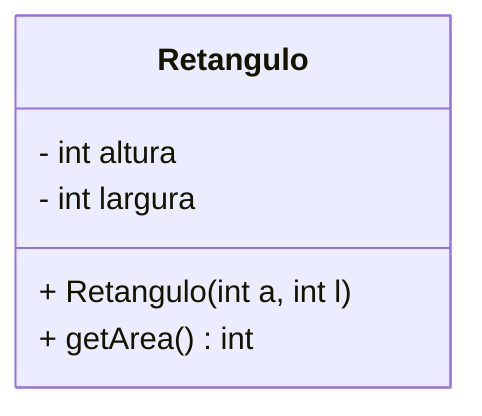
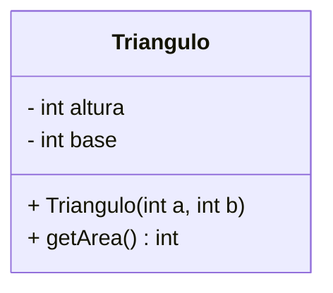
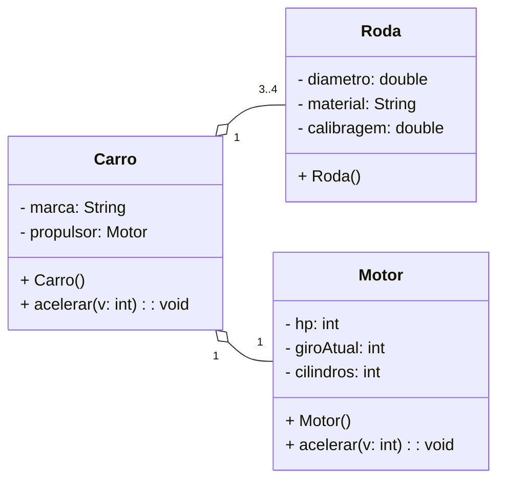
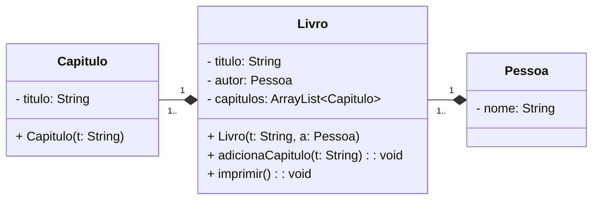

# Diagrama de classes UML

## Retângulo

```mermaid
classDiagram
    class Retangulo{
        - int altura
        - int largura
        + Retangulo(int a, int l)
        + getArea() int
    }
```

## Triângulo

```mermaid
classDiagram
    class Triangulo{
        - int altura
        - int base
        + Triangulo(int a, int b)
        + getArea() int
    }
```

## Carro/Motor/Roda

```mermaid
classDiagram
        direction RL

    class Roda{
        - diametro: double
        - material: String
        - calibragem: double
        + Roda()
    }

    Roda "3..4" --o "1" Carro

    class Carro{
        - marca: String
        - propulsor: Motor
        + Carro()
        + acelerar(v: int): void
    }

    Motor "1" --o "1" Carro

    class Motor{
        - hp: int
        - giroAtual: int
        - cilindros: int
        + Motor()
        + acelerar(v: int): void
    }
```

## Livro/Capítulo

```mermaid
classDiagram
    direction LR
    
    class Capitulo{
        - titulo: String
        + Capitulo(t: String)
    }
    
    Capitulo "1.." --* "1" Livro
    Livro "1.." --* "1" Pessoa

    class Livro{
        - titulo: String
        - autor: Pessoa
        - capitulos: ArrayList~Capitulo~
        + Livro(t: String, a: Pessoa)
        + adicionaCapitulo(t: String): void
        + imprimir(): void
    }

    class Pessoa{
        - nome: String
    }
```