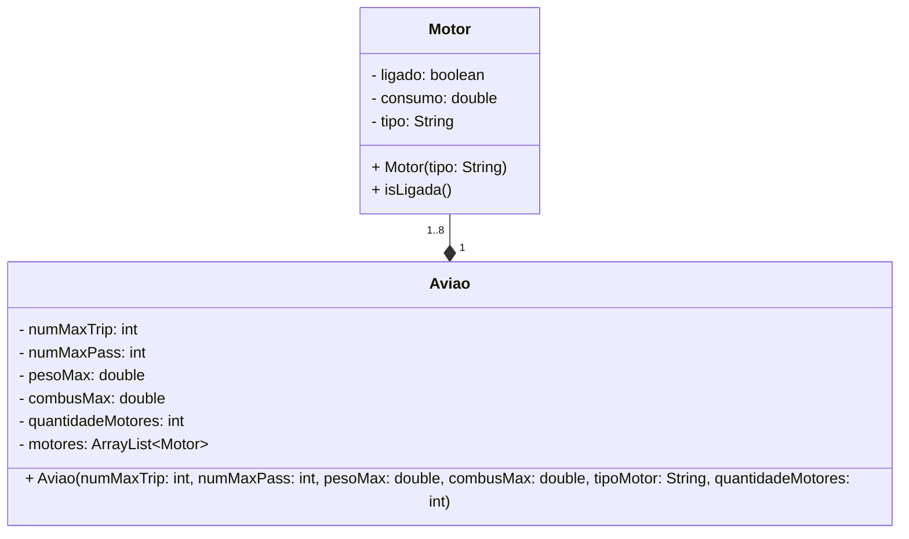

# Dependência

```mermaid

classDiagram
    direction TB
    
    class Aviao {
    - numMaxTrip: int
    - numMaxPass: int
    - pesoMax: double
    - combusMax: double
    - quantidadeMotores: int
    - motores: ArrayList~Motor~
    + Aviao(numMaxTrip: int, numMaxPass: int, pesoMax: double, combusMax: double, tipoMotor: String, quantidadeMotores: int)
    }

    Motor"1..8" --* "1"Aviao
    
    class Motor {
        - ligado: boolean
        - consumo: double
        - tipo: String
        + Motor(tipo: String)
        + isLigada()
    }
```