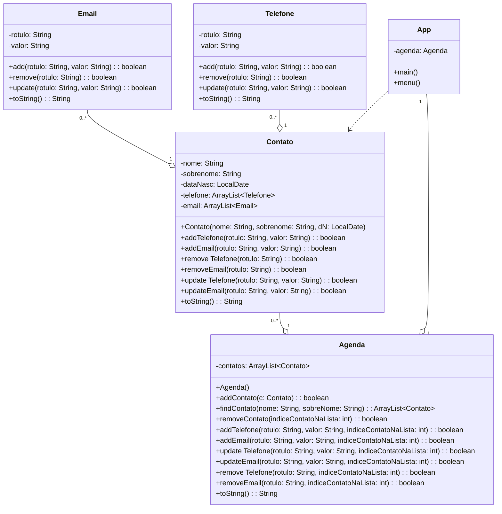

#  Agenda Telefônica

```mermaid

classDiagram 
    direction TB
    
    Contato"0..*"--o"1"Agenda
    Email"0..*"--o"1"Contato
    Telefone"0..*"--o"1"Contato
    App..>Contato
    App"1"--o"1"Agenda

    class App {
        -agenda: Agenda
        +main()
        +menu()
    }

    class Agenda {
        -contatos: ArrayList~Contato~
        +Agenda()
        +addContato(c: Contato): boolean
        +findContato (nome: String, sobreNome: String): ArrayList~Contato~ 
        +removeContato (indiceContatoNaLista: int): boolean
        +addTelefone(rotulo: String, valor: String, indiceContatoNaLista: int): boolean 
        +addEmail(rotulo: String, valor: String, indiceContatoNaLista: int): boolean 
        +update Telefone(rotulo: String, valor: String, indiceContatoNaLista: int): boolean 
        +updateEmail(rotulo: String, valor: String, indiceContatoNaLista: int): boolean 
        +remove Telefone (rotulo: String, indiceContatoNaLista: int): boolean 
        +removeEmail(rotulo: String, indiceContatoNaLista: int): boolean
        +toString(): String
    }
    
    class Contato {
        -nome: String 
        -sobrenome: String
        -dataNasc: LocalDate
        -telefone: ArrayList~Telefone~
        -email: ArrayList~Email~
        +Contato(nome: String, sobrenome: String, dN: LocalDate) 
        +addTelefone(rotulo: String, valor: String): boolean 
        +addEmail(rotulo: String, valor: String): boolean 
        +remove Telefone(rotulo: String): boolean 
        +removeEmail(rotulo: String): boolean
        +update Telefone(rotulo: String, valor: String): boolean 
        +updateEmail(rotulo: String, valor: String): boolean
        +toString(): String
    }
    
    class Email {
        -rotulo: String
        -valor: String
        +add(rotulo: String, valor: String): boolean 
        +remove(rotulo: String): boolean
        +update(rotulo: String, valor: String): boolean 
        +toString(): String
    }
    
    class Telefone {
        -rotulo: String
        -valor: String
        +add(rotulo: String, valor: String): boolean
        +remove(rotulo: String): boolean
        +update(rotulo: String, valor: String): boolean
        +toString(): String
    }
```