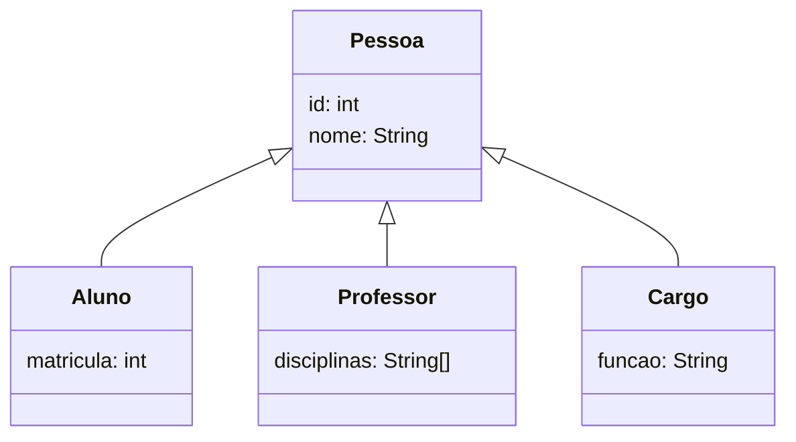
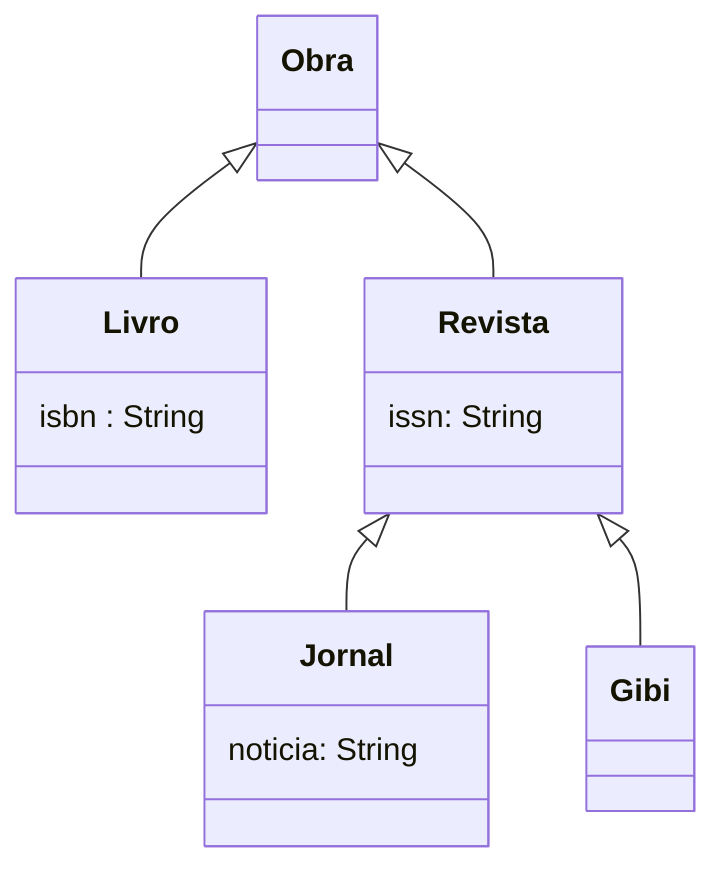
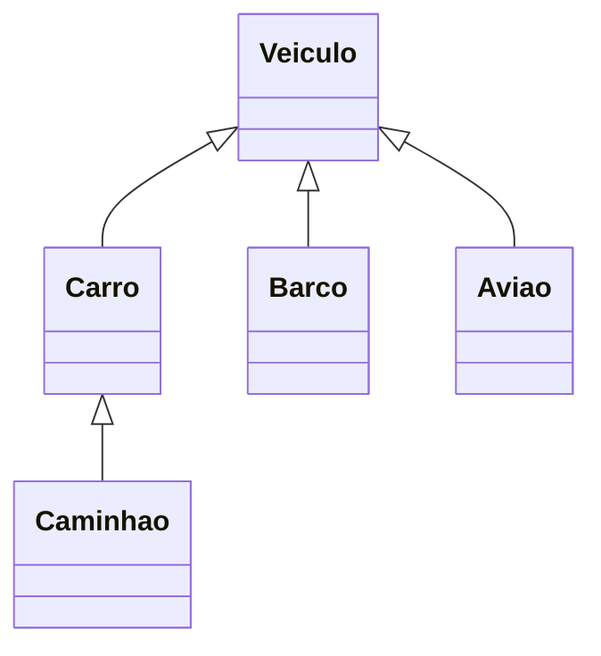
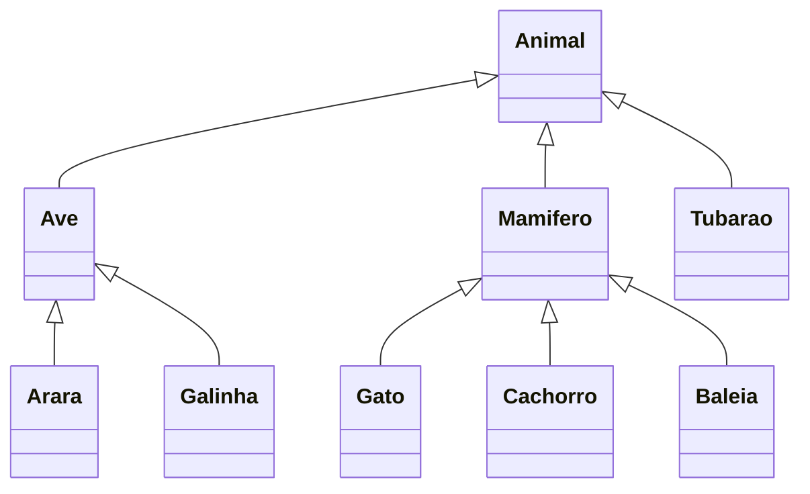

# Escola

```mermaid
classDiagram
    
    Pessoa <|-- Aluno
    Pessoa <|-- Professor
    Pessoa <|-- Cargo
    
    class Pessoa {
        id: int
        nome: String
    }
    
    class Aluno {
        matricula: int
    }
    
    class Professor {
        disciplinas: String[]
    }

    class Cargo {
        funcao: String 
%%      DIRETOR/COORDENADOR
    }
```

# Livraria

```mermaid
classDiagram

    Obra <|-- Livro
    Obra <|-- Revista
    Revista <|-- Jornal
    Revista <|-- Gibi
    
    class Obra { 
        
    }
    
    class Livro {
        isbn : String
    }
    
    class Revista {
        issn: String
    }

    class Jornal {
        noticia: String
    }
    
    class Gibi {
    }
```

# Veiculos

```mermaid
classDiagram

    Veiculo <|-- Carro
    Carro <|-- Caminhao
    Veiculo <|-- Barco
    Veiculo <|-- Aviao
    
    class Veiculo {
        
    }
    
    class Carro {
        
    }

    class Caminhao {
        
    }
    
    class Aviao {
        
    }

    class Barco {

    }
```

# Animais

```mermaid
classDiagram

    Animal <|-- Ave
    Animal <|-- Mamifero
    Animal <|-- Tubarao
    Ave <|-- Arara
    Ave <|-- Galinha
    Mamifero <|-- Gato
    Mamifero <|-- Cachorro
    Mamifero <|-- Baleia
    
    class Animal {
        
    }
    
    class Ave {
        
    }

    class Mamifero {
        
    }

    class Gato {

    }

    class Cachorro {

    }

    class Arara {

    }

    class Galinha {

    }

    class Baleia {

    }

    class Tubarao {

    }
```