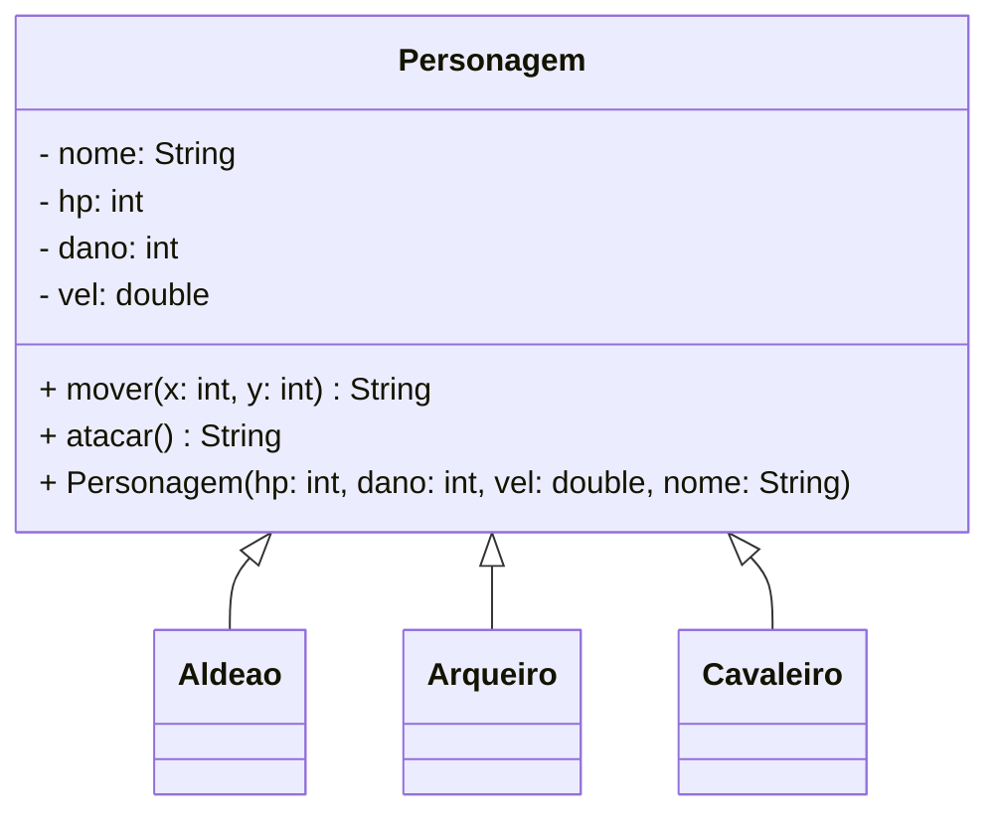

# Java of Empires

```mermaid

classDiagram
    direction TB
    
    Personagem <|-- Aldeao
    Personagem <|-- Arqueiro
    Personagem <|-- Cavaleiro

    class Personagem {
        - nome: String
        - hp: int
        - dano: int
        - vel: double
        + mover(x: int, y: int) String
        + atacar() String
        + Personagem(hp: int, dano: int, vel: double, nome: String)
    }
```