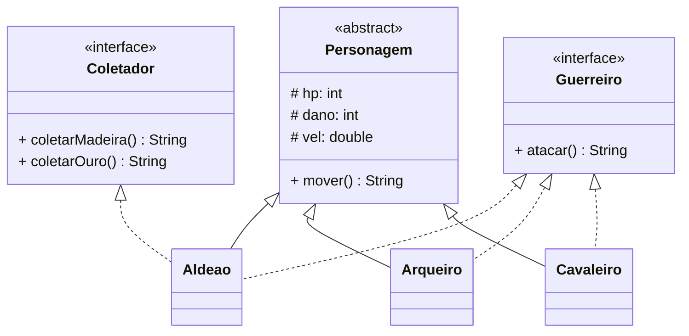

# Java of Empires

```mermaid

classDiagram
direction TB

    class Coletador {
        <<interface>>
        + coletarMadeira() String
        + coletarOuro() String
    }

    class Personagem {
        <<abstract>>
        # hp: int
        # dano: int
        # vel: double
        + mover() String
    }

    class Guerreiro {
        <<interface>>
        + atacar() String
    }

    Personagem <|-- Aldeao
    Personagem <|-- Arqueiro
    Personagem <|-- Cavaleiro
    
    Coletador <|.. Aldeao
    Guerreiro <|.. Aldeao
    
    Guerreiro <|.. Arqueiro
    Guerreiro <|.. Cavaleiro
```