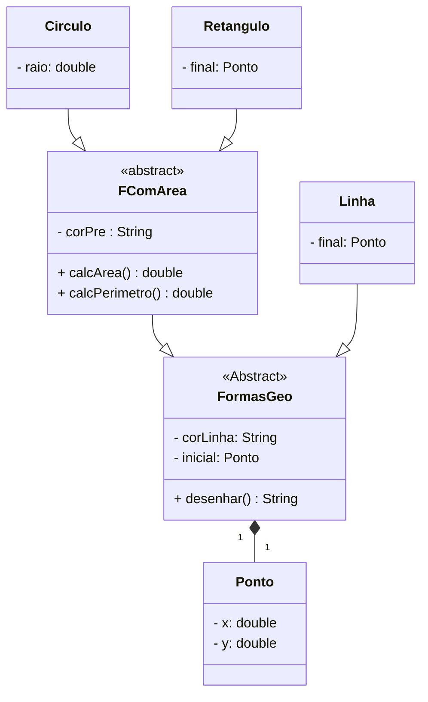

# Desenho 2D

```mermaid

classDiagram
    direction BT
    
    FormasGeo <|-- FComArea
    Ponto "1" --* "1" FormasGeo
    FormasGeo <|-- Linha
    FComArea <|-- Circulo
    FComArea <|-- Retangulo

    class FormasGeo {
        <<Abstract>>
        - corLinha: String
        - inicial: Ponto
        + desenhar() String
    }
    
    class Ponto {
        - x: double
        - y: double
    }
    
    class FComArea {
        <<abstract>>
        - corPre : String
        + calcArea() double
        + calcPerimetro() double
        }
        
class Linha {
    - final: Ponto
}

class Circulo {
    - raio: double
 }
 
 class Retangulo {
     - final: Ponto
 }
```