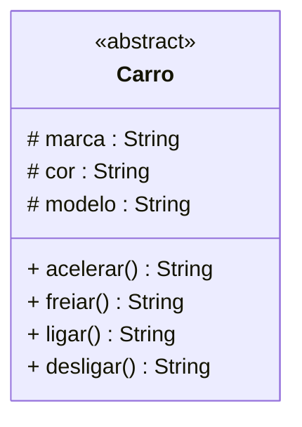

# Jogo de corrida

```mermaid

classDiagram
    
    class Carro {
        <<abstract>>
        # marca : String
        # cor : String
        # modelo : String
        + acelerar() String
        + freiar() String
        + ligar() String
        + desligar() String
    }
```