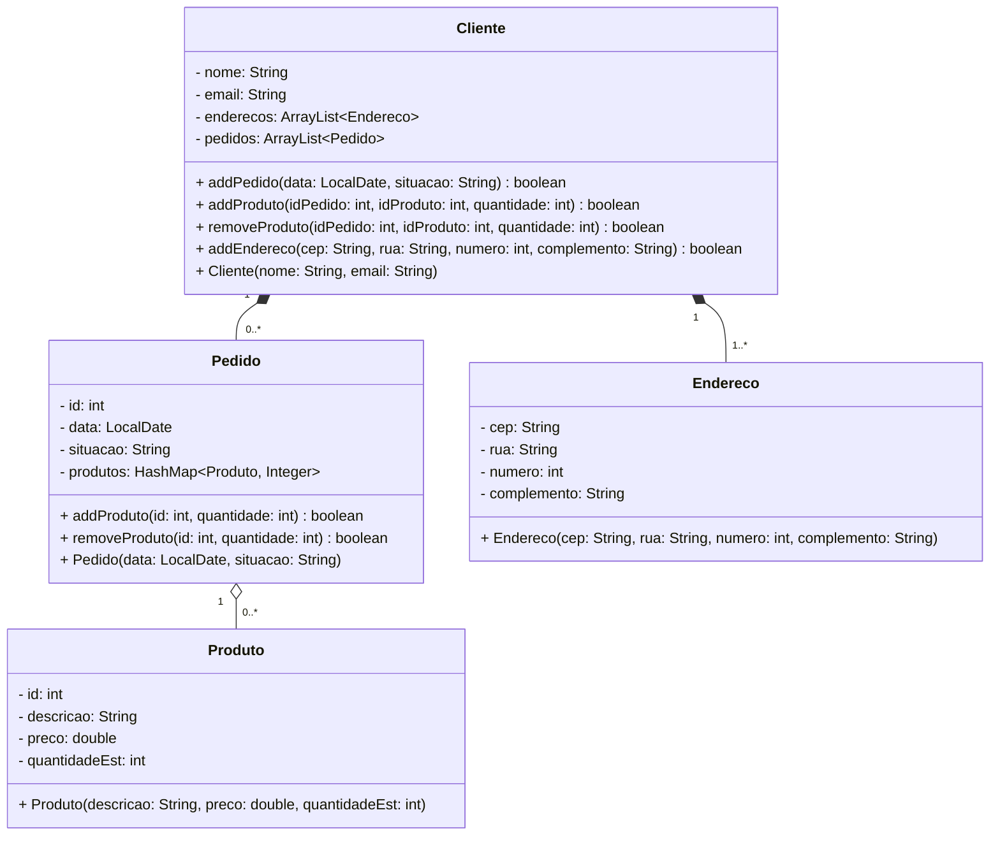
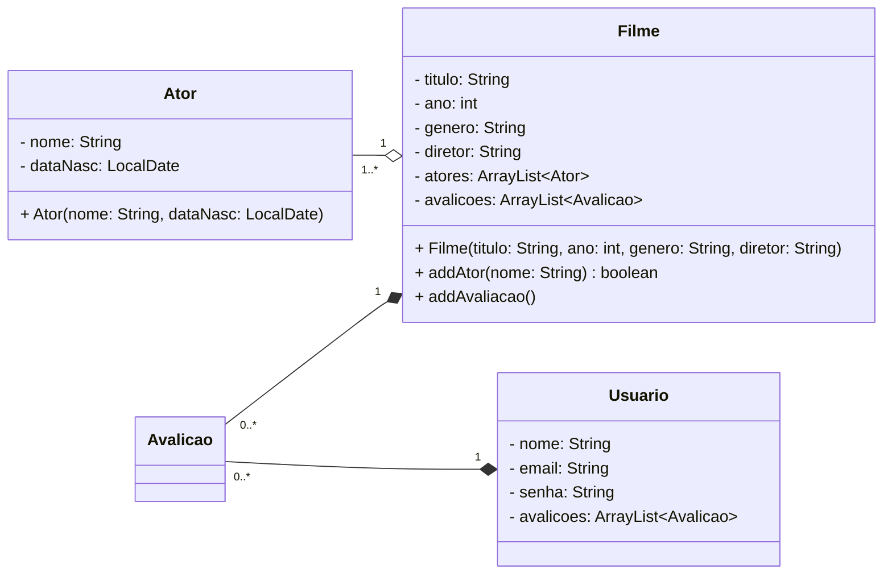

# Diagramas UML

## Sistema de comércio eletrônico
> Um produto tem uma descrição, um preço e uma quantidade em estoque. Um cliente tem um nome, um
e-mail e um ou mais endereços de entrega. Um cliente pode fazer um ou mais pedidos. Um pedido tem uma
data, uma situação (pendente, pago, entregue, cancelado), um ou mais produtos, sendo que cada produto
tem uma quantidade e um preço unitário.

## Sistema de avaliações de filmes
> Um filme tem um título, um ano de lançamento, um gênero, um diretor e um ou mais atores. Um ator tem
um nome e uma data de nascimento. Um filme pode ter uma ou mais avaliações, e cada avaliação está
associada a um único filme e a um único usuário. Um usuário tem um nome, um e-mail e uma senha. Um
usuário pode avaliar um ou mais filmes. Uma avaliação tem uma nota (de 1 a 5) e um comentário.

