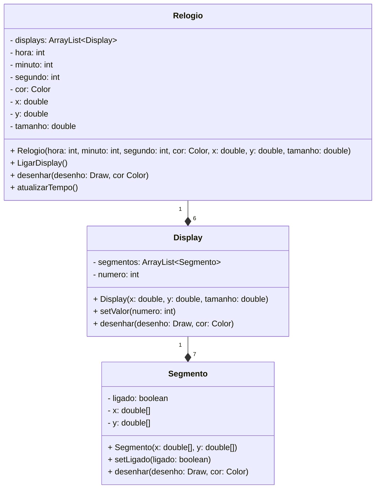

# Relógio digital

```mermaid
classDiagram
    direction TB
    
    Relogio "1" --* "6" Display
    Display "1" --* "7" Segmento
 
    class Relogio {
            - displays: ArrayList~Display~
            - hora: int
            - minuto: int
            - segundo: int
            - cor: Color
            - x: double
            - y: double
            - tamanho: double
            + Relogio(hora: int, minuto: int, segundo: int, cor: Color, x: double, y: double, tamanho: double)
            + LigarDisplay()
            + desenhar(desenho: Draw, cor Color)
            + atualizarTempo()
        }

    class Display {
        - segmentos: ArrayList~Segmento~
        - numero: int
        + Display(x: double, y: double, tamanho: double)
        + setValor(numero: int)
        + desenhar(desenho: Draw, cor: Color)
    }

    class Segmento {
        - ligado: boolean
        - x: double[]
        - y: double[]
        + Segmento(x: double[], y: double[])
        + setLigado(ligado: boolean)
        + desenhar(desenho: Draw, cor: Color)
    }
```