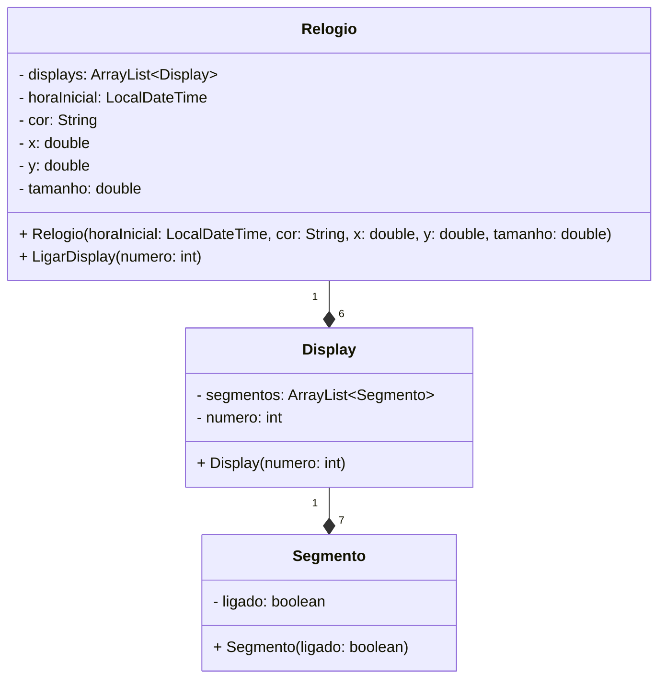

# Relógio digital

```mermaid
classDiagram
    direction TB
    
    Relogio "1" --* "6" Display
    Display "1" --* "7" Segmento

    class Relogio {
            - displays: ArrayList~Display~
            - horaInicial: LocalDateTime
            - cor: String
            - x: double
            - y: double
            - tamanho: double
            + Relogio(horaInicial: LocalDateTime, cor: String, x: double, y: double, tamanho: double)
            + LigarDisplay(numero: int)
        }

    class Display {
        - segmentos: ArrayList~Segmento~
        - numero: int
        + Display(numero: int)
    }

    class Segmento {
        - ligado: boolean
        + Segmento(ligado: boolean)
    }
```