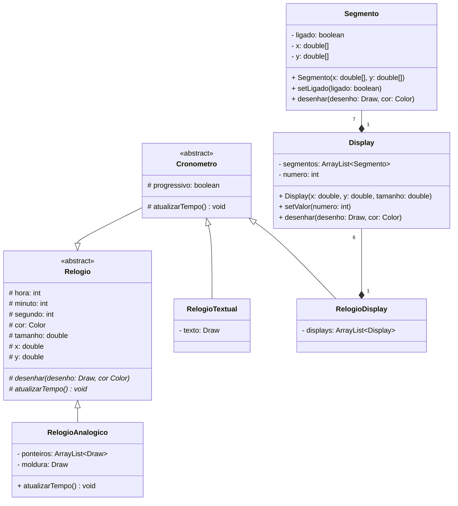

```mermaid
classDiagram
direction BT

    RelogioDisplay --|> Cronometro
    RelogioTextual --|> Cronometro
    RelogioAnalogico --|> Relogio

    RelogioDisplay "1" *-- "6" Display
    Display "1" *-- "7" Segmento

    Relogio <|-- Cronometro
    
    class Relogio {
        <<abstract>>
                # hora: int
                # minuto: int
                # segundo: int
                # cor: Color
                # tamanho: double
                # x: double
                # y: double
                # desenhar(desenho: Draw, cor Color)*
                # atualizarTempo() void*
    }

    class Cronometro {
        <<abstract>>
        # progressivo: boolean
        # atualizarTempo() void
    }

    class RelogioDisplay {
        - displays: ArrayList~Display~
    }

    class RelogioTextual {
        - texto: Draw
    }

    class RelogioAnalogico {
        - ponteiros: ArrayList~Draw~
        - moldura: Draw
        + atualizarTempo() void
    }

    class Display {
        - segmentos: ArrayList~Segmento~
        - numero: int
        + Display(x: double, y: double, tamanho: double)
        + setValor(numero: int)
        + desenhar(desenho: Draw, cor: Color)
    }

    class Segmento {
        - ligado: boolean
        - x: double[]
        - y: double[]
        + Segmento(x: double[], y: double[])
        + setLigado(ligado: boolean)
        + desenhar(desenho: Draw, cor: Color)
    }


```