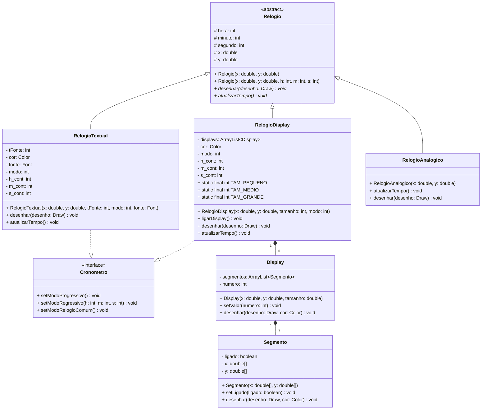

```mermaid
classDiagram
    
    RelogioDisplay ..|> Cronometro
    RelogioTextual ..|> Cronometro
    
    Relogio <|-- RelogioAnalogico
    Relogio <|-- RelogioDisplay
    Relogio <|-- RelogioTextual

    RelogioDisplay "1" *-- "6" Display
    Display "1" *-- "7" Segmento

    class Relogio {
        <<abstract>>
        # hora: int
        # minuto: int
        # segundo: int
        # x: double
        # y: double
        + Relogio(x: double, y: double)
        + Relogio(x: double, y: double, h: int, m: int, s: int)
        + desenhar(desenho: Draw)* void
        + atualizarTempo()* void
    }

    class Cronometro {
        <<interface>>
        + setModoProgressivo() void
        + setModoRegressivo(h: int, m: int, s: int) void
        + setModoRelogioComum() void
    }

    class RelogioDisplay {
        - displays: ArrayList~Display~
        - cor: Color
        - modo: int
        - h_cont: int
        - m_cont: int
        - s_cont: int
        + static final int TAM_PEQUENO
        + static final int TAM_MEDIO
        + static final int TAM_GRANDE
        + RelogioDisplay(x: double, y: double, tamanho: int, modo: int)
        + ligarDisplay() void
        + desenhar(desenho: Draw) void
        + atualizarTempo() void
    }

    class RelogioTextual {
        - tFonte: int
        - cor: Color
        - fonte: Font
        - modo: int
        - h_cont: int
        - m_cont: int
        - s_cont: int
        + RelogioTextual(x: double, y: double, tFonte: int, modo: int, fonte: Font)
        + desenhar(desenho: Draw) void
        + atualizarTempo() void
    }

    class RelogioAnalogico {
        + RelogioAnalogico(x: double, y: double)
        + atualizarTempo() void
        + desenhar(desenho: Draw) void
    }

    class Display {
        - segmentos: ArrayList~Segmento~
        - numero: int
        + Display(x: double, y: double, tamanho: double)
        + setValor(numero: int) void
        + desenhar(desenho: Draw, cor: Color) void
    }

    class Segmento {
        - ligado: boolean
        - x: double[]
        - y: double[]
        + Segmento(x: double[], y: double[])
        + setLigado(ligado: boolean) void
        + desenhar(desenho: Draw, cor: Color) void
    }
```