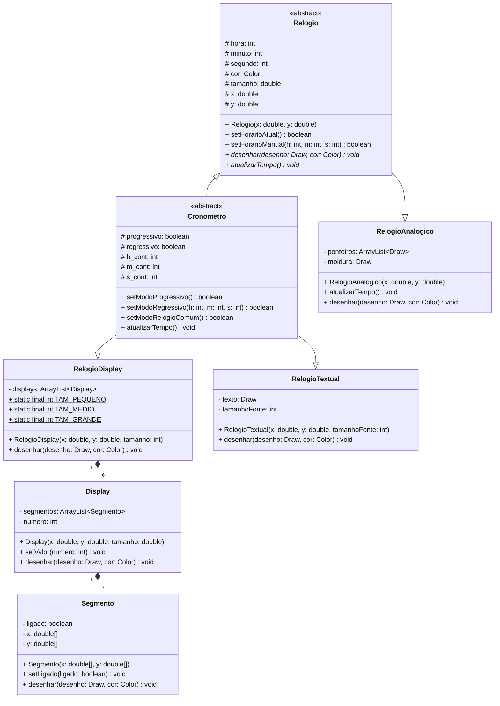

```mermaid
classDiagram
    direction TB

    Cronometro --|> RelogioDisplay
    Cronometro --|> RelogioTextual
    Relogio --|> RelogioAnalogico

    RelogioDisplay "1" *-- "6" Display
    Display "1" *-- "7" Segmento

    Relogio <|-- Cronometro

    class Relogio {
        <<abstract>>
        # hora: int
        # minuto: int
        # segundo: int
        # cor: Color
        # tamanho: double
        # x: double
        # y: double
        + Relogio(x: double, y: double)
        + setHorarioAtual() boolean
        + setHorarioManual(h: int, m: int, s: int) boolean 
        + desenhar(desenho: Draw, cor: Color)* void
        + atualizarTempo()* void
    }

    class Cronometro {
        <<abstract>>
        # progressivo: boolean 
        # regressivo: boolean 
        # h_cont: int 
        # m_cont: int 
        # s_cont: int
        + setModoProgressivo() boolean
        + setModoRegressivo(h: int, m: int, s: int) boolean
        + setModoRelogioComum() boolean 
        + atualizarTempo() void
    }

    class RelogioDisplay {
        - displays: ArrayList~Display~ 
        + static final int TAM_PEQUENO$
        + static final int TAM_MEDIO$
        + static final int TAM_GRANDE$
        + RelogioDisplay(x: double, y: double, tamanho: int) 
        + desenhar(desenho: Draw, cor: Color) void
    }

    class RelogioTextual {
        - texto: Draw 
        - tamanhoFonte: int
        + RelogioTextual(x: double, y: double, tamanhoFonte: int) 
        + desenhar(desenho: Draw, cor: Color) void
    }

    class RelogioAnalogico {
        - ponteiros: ArrayList~Draw~ 
        - moldura: Draw 
        + RelogioAnalogico(x: double, y: double) 
        + atualizarTempo() void
        + desenhar(desenho: Draw, cor: Color) void 
    }

    class Display {
        - segmentos: ArrayList~Segmento~
        - numero: int 
        + Display(x: double, y: double, tamanho: double) 
        + setValor(numero: int) void 
        + desenhar(desenho: Draw, cor: Color) void
    }

    class Segmento {
        - ligado: boolean 
        - x: double[]
        - y: double[] 
        + Segmento(x: double[], y: double[])
        + setLigado(ligado: boolean) void
        + desenhar(desenho: Draw, cor: Color) void
    }
```