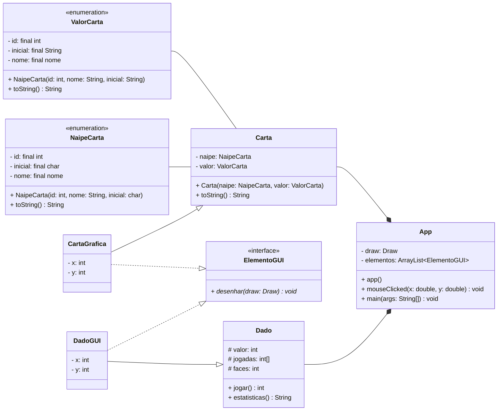

# DADOS

```mermaid
classDiagram
direction LR

Dado --* App
Carta --* App

DadoGUI --|> Dado

CartaGrafica ..|> ElementoGUI
DadoGUI ..|> ElementoGUI

CartaGrafica --|> Carta
NaipeCarta -- Carta
ValorCarta -- Carta

class App {
     - draw: Draw
     - elementos: ArrayList~ElementoGUI~
     + app()
     + mouseClicked(x: double, y: double) void
     + main(args: String[]) void
}

class ElementoGUI {
    <<interface>>
    + desenhar(draw: Draw) void*
}

class Carta {
    - naipe: NaipeCarta
    - valor: ValorCarta
    + Carta(naipe: NaipeCarta, valor: ValorCarta)
    + toString() String
}

class CartaGrafica {
    - x: int
    - y: int
}

class Dado {
    # valor: int
    # jogadas: int[]
    # faces: int
    + jogar() int
    + estatisticas() String
}

class DadoGUI {
    - x: int
    - y: int
}

class NaipeCarta {
    <<enumeration>> 
    - id: final int
    - inicial: final char
    - nome: final nome
    + NaipeCarta(id: int, nome: String, inicial: char)
    + toString() String
}

class ValorCarta {
<<enumeration>>
- id: final int
- inicial: final String
- nome: final nome
+ NaipeCarta(id: int, nome: String, inicial: String)
+ toString() String
}

```